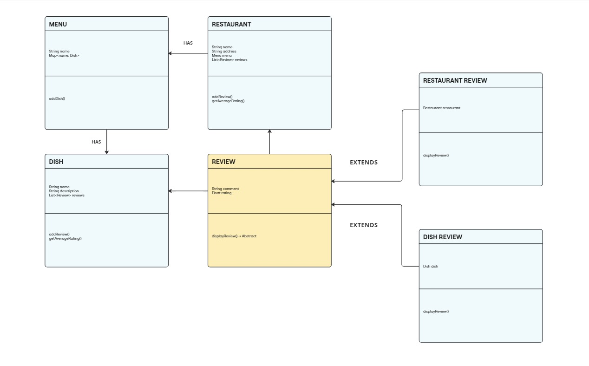
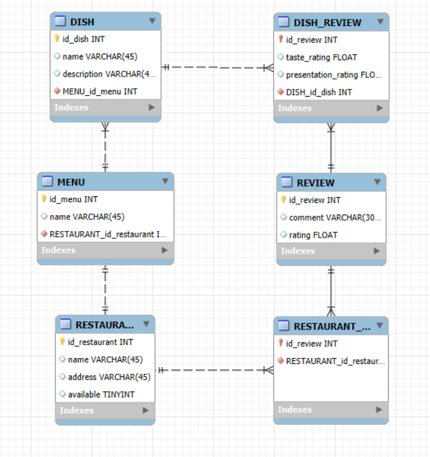

# 🍱 Restaurant Reviewer
[](#)<br><br>

## Descripción
**Restaurant Reviewer** es una aplicación interactiva diseñada para gestionar información de restaurantes y sus platos, además de permitir a los usuarios agregar reseñas para evaluar la calidad de los servicios y productos ofrecidos.

## Características
1. **Gestión de restaurantes:**
   - **Registro:** añadir nuevos restaurantes especificando nombre, ubicación y disponibilidad.
   - **Edición:** posibilidad de actualizar información como la dirección o disponibilidad del restaurante.
   - **Eliminación:** facilita la eliminación de restaurantes obsoletos o irrelevantes.
2. **Gestión de platos:**
   - **Registro:** agrega platos al menú de cada restaurante con detalles como nombre, descripción y precio.
   - **Edición:** permite modificar información de los platos existentes.
   - **Eliminación:** elimina platos que ya no están disponibles o que han sido reemplazados.
3. **Sistema de reseñas:**
    - **Reseñas de restaurantes:** los usuarios pueden calificar y escribir opiniones sobre los restaurantes registrados.
    - **Reseñas de platos:** evaluación de platos específicos con calificaciones y comentarios.
    - **Promedios de calificación:** muestra una puntuación promedio basada en las reseñas de usuarios.
4. **Visualización y consulta:**
    - Muestra la lista de restaurantes con sus detalles y el menú asociado.
    - Consulta de reseñas para restaurantes y platos.

## Tecnologías
- **Java JDK 17**
- **Gradle**: Herramienta para la construcción y gestión del proyecto.
- **Java Collections**: Uso de listas para simular la gestión de datos en memoria.

## Instalación y Configuración
1. **Clona el Repositorio:**
   ```bash
   git clone https://github.com/KJRM20/06-plataforma-reviews.git
   ```
2. **Compila y ejecuta el proyecto:**
    - Abre el proyecto en tu IDE y ejecuta la clase principal ```App```.
    - Alternativamente, usa Gradle desde la línea de comandos:
      ```bash
      gradle run
      ```
3. **Interactúa con el sistema:**
    - Sigue las instrucciones que se presentan en la consola para realizar las operaciones disponibles.

## Arquitectura y Funcionalidad
El proyecto está organizado en una estructura simple basada en POO que simula una base de datos en memoria.


[Enlace del diagrama](https://miro.com/app/board/uXjVLzSamIM=/?share_link_id=10613882267)

Además, se tiene la estructura para su correspondiente BBDD:



## Contacto
Para preguntas, problemas o colaboraciones, por favor, contáctame.

-----

¡Gracias por tu interés en este reviewer de restaurantes! 🎉
<br><small>Realizado por Karen Rincón, 2024</small><br><br>
[](https://github.com/KJRM20)
[](https://www.linkedin.com/in/karen-rincon/) 